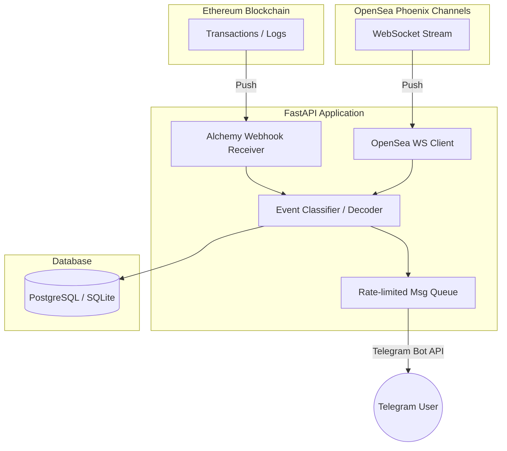

# Aster Tracker 🛡️ — Ethereum Wallet Activity Telegram Bot

Aster Tracker is a standalone, read-only monitoring bot that delivers real-time Telegram notifications when watched Ethereum wallets perform on-chain and off-chain activities:
- 🎨 **Minting NFTs** (ERC-721 and ERC-1155)
- 🛒 **Buying NFTs** on secondary markets (Seaport/OpenSea, Blur V1, LooksRare V2, X2Y2)
- ✅ **Selling NFTs** on secondary markets
- 💰 **Buying ERC-20 Tokens** via DEX swaps (Uniswap V2 & V3 pools)
- 🏷️ **Listing NFTs** for sale on OpenSea (real-time stream)

---

## 🏗️ Architecture



- **On-chain Events:** Triggered instantly by Alchemy Address Activity webhooks and decoded via transaction log parsing (`web3.py`).
- **Off-chain Listings:** Real-time stream using OpenSea phoenix channels protocol to subscribe globally to `collection:*` `item_listed` events and filtered locally against the active tracked list in the database.
- **Idempotency Guard:** `seen_events` table ensures duplicate notifications are never sent.
- **Rate-limiter Worker:** Employs a token bucket logic to respect Telegram's message limits (maximum 1 msg/second per chat).

---

## 🛠️ Installation & Setup

### Prerequisites
- Python 3.12+
- PostgreSQL database (or local SQLite in-memory database for testing)
- Telegram Bot Token (from [@BotFather](https://t.me/BotFather))
- Alchemy API Key & Webhook ID (from the [Alchemy Dashboard](https://dashboard.alchemy.com/))
- OpenSea API Key (from the [OpenSea Developer Portal](https://docs.opensea.io/reference/request-an-api-key))

### Setup Steps
1. **Clone the repository and enter the directory:**
   ```bash
   cd "Aster Tracker"
   ```

2. **Copy `.env.example` to `.env` and fill in all variables:**
   ```bash
   cp .env.example .env
   ```

3. **Install dependencies:**
   ```bash
   pip install -r requirements.txt
   ```

4. **Run database migrations:**
   ```bash
   alembic upgrade head
   ```

5. **Start the application:**
   ```bash
   uvicorn app.main:app --host 0.0.0.0 --port 8000
   ```

---

## 🤖 Telegram Bot Commands

- `/start` — Register user profile and display welcome screen.
- `/track <address> [label]` — Start monitoring an Ethereum address. Automatically updates the Alchemy webhook watch-list.
- `/untrack <address>` — Stop monitoring an address. Cleans up the Alchemy webhook if no other users track it.
- `/list` — View your actively tracked wallets and their labels.
- `/filters <address>` — Open an inline toggle menu to customize notifications (Mint, Buy NFT, Sell NFT, Token Buy, Listings) or set minimum value thresholds (e.g. mute events below `0.1 ETH`).
- `/help` — Display command references.

---

## 🧪 Running Unit Tests
Unit tests use SQLite in-memory databases and mocked Bot connections so they do not touch live blockchain RPCs or Telegram.
```bash
pytest
```
